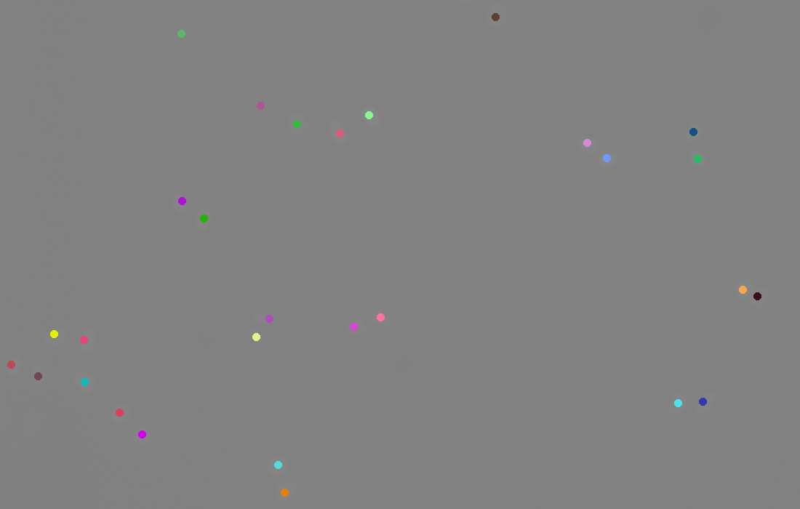

# Multiobject Tracking of Biological Cells using a GM-PHD filter 

This repository contains code for an implementation of the GM-PHD filter proposed
by _Vo and Ma_ ([ref](link)), with some slight modifications, designed to enable
multiobject tracking of cells from brightfield images. While code to extract
cell positions - the measurements - is provided, this is utilize a very
simplistic strategy which will not provide optimal results.:


# Usage
The main program is `celltracker.py` which performs the state estimation based
on the observations. In order to apply `celltracker` to a data set of, it first
needs to be formatted into the expected output; outlined below.

## Input format 

The expected input to `celltracker` is a tab separated file with three required
columns (_x,y_ and _time_). The _x_ and _y_ fields gives the spatial coordinates
of an observation, and the time field at which point in time this observation
was made. See the example below:

|           |      x |     y |   time |
|:----------|-------:|------:|-------:|
| t_0_obs_0 |  164.5 | 567.5 |      0 |
| t_0_obs_1 |  280.5 | 300.5 |      0 |
| t_0_obs_2 |  408.5 | 170.5 |      0 |
| t_0_obs_3 | 1041.5 | 407.5 |      0 |
| t_0_obs_4 |  382.5 | 639.5 |      0 |


Given a set of brightfield images this table can easily be generated using the
`img2obs.py` script provided, using the following commands:

```sh
$> python3 ./img2obs.py -i IMAGE_PATHS -o /tmp/cellid2 --tag "example"

```

To also save the processed images and the identified cell centers, instead run:

```sh
$> python3 ./img2obs.py -i IMAGE_PATHS -o /tmp/cellid2 --tag "example" --include_processed_image  --mark_images

```

## Model Specifications

Once the data has been processed and the data cast into the proper input format,
running `celltracker`, only one thing remains to be done: specification of the
model. To avoid a cluttered command with plenty of different parameters, this is
done via an auxiliary configuration file (a YAML file): More precisely the
should be structured as follows:

```yaml

F: np.eye(2) # transition matrix
pD: 0.4 # detection probability
pS: 0.8 # survival probability
S: 10 * np.eye(2) # covariance for initial components
Q: 20 * np.eye(2) # process noise covariance
R: 20 * np.eye(2) # measurement noise covariance
clutter: 1e-6 # clutter (Kappa) parameter
thrs_T: 1e-3 # truncation threshold
thrs_U: 2 # merging threshold
J_max: 100 # maximum allowable number of gaussian components
spawn_params: # spawn parmaters (set to None to exclude spawning)
  N: 5 # number of new components from each existing
  w: 1e-6 # weights assigned to new components
  d: np.zeros(2) # bias in linear transformation
  Q: 10 * np.eye(2) # covariance matrix for new components
  F: np.eye(2) # transition matrix
birth_params: # birth parameters (set to None to exclude birth)
  N : 10 # number of new components
  w: 1e-8 # weights for new components
  S: 10 * np.eye(2) # covariance matrix for new components

```

_NOTE_ : `numpy` syntax is supported, and can be used to specify covariance matrices etc.

Chose a set of appropriate parameters and construct your own model
specification, or use one of the pre-existing found in the `configs` folder.

## Running celltracker

With the formatted input data and model design file, you are now ready to run
`celltracker`. To do this, simply do:

```sh

$> python3 ./celltrack.py -z INPUT_FILE -mp CONFIG_FILE -t0 0 -o OUT_DIR  --tag "example"

```

To also produce an animation (only supported on Linux systems), of the results you can instead do:

```sh

$> python3 ./celltrack.py -z INPUT_FILE -mp CONFIG_FILE -t0 0 -o OUT_DIR  --tag "example" --animate --images IMAGE_DIR

```

# Examples

As an example we can use the Dataset _"HeLa cells stably expressing H2b-GFP"_ from [celltrackingchallenge.net](http://celltrackingchallenge.net/2d-datasets/). The first subset of raw images consist of 93 brightfield images:


When processed with `img2obs.py`, we end up with the following result:


Running this through `celltracker` we get:


